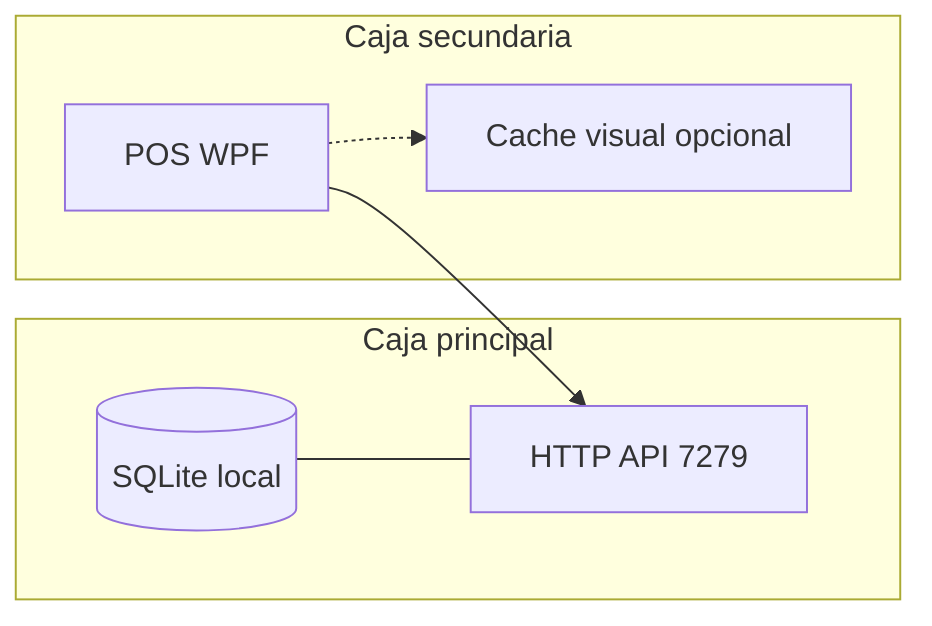

# Multicaja estilo servidor central (referencia Eleventa)

Este documento describe el **estado actual** del POS, **por qué falla o es frágil** la multicaja heredada, el **objetivo** de arquitectura tipo Eleventa y **qué se reemplaza en cada fase** sin romper el producto de un solo golpe.

## 1. Objetivo operativo

- **Una caja principal** aloja la base SQLite “de verdad”, corre la API embebida (`GrunflexPOS.API`, puerto típico **7279**) y opcionalmente expone el recurso SMB para compatibilidad.
- **Cajas secundarias** son **clientes ligeros**: la fuente de verdad para negocio crítico es la principal; la LAN debe ser estable y predecible.
- **Sin sincronización peer-to-peer** ni “dos escritores” compitiendo por la misma verdad sin coordinación clara.

## 2. Estado actual del código (resumen honesto)

| Capa | Comportamiento |
|------|----------------|
| **BD en secundaria (legacy)** | Opción A: **UNC** `\\HOST\GrunflexPOS\grunflex.db` (SQLite/SMB). Opción B (**recomendada**): **`Multicaja:UseApiOnlyClient=true`** → SQLite sombra local `%LocalAppData%\GrunflexPOS\data\terminal_shadow.db` sin SMB. |
| **API HTTP** | Secundaria usa `Api:BaseUrl` hacia la principal. Con API-only, el saneo de host desde UNC ya no aplica; la IP del servidor debe estar en `Api:BaseUrl` (instalador cliente). |
| **Catálogo / productos** | `ProductosController` en la API usa **`PosCommerceDbContext`** → misma tabla `Productos` en `grunflex.db` del servidor. Cliente: `ProductoApiService` + fallback local en sombra. |
| **Ventas (API-only)** | **`POST /api/multicaja/ventas/commit`**: transacción serializable en servidor; stock, folio (`MAX+1`), usuario, sesión; idempotencia `MulticajaVentaIdempotency`; movimiento de caja. Cliente **no** escribe `Ventas` en sombra para el flujo central. |
| **Ventas (legacy UNC)** | Sin cambiar `UseApiOnlyClient`, el flujo histórico sigue por EF + UNC. |
| **Conectividad** | `ConnectivityMonitor` hace **GET** periódico a `/health/live` (heartbeat de aplicación sobre HTTP, no un socket aparte). |
| **Migraciones** | En cliente UNC se evita `Migrate()` agresivo para no pelear locks con el servidor. |
| **SQLite + red** | `SqliteBusyTimeoutInterceptor` y timeouts mitigan **bloqueos y latencia SMB**; no eliminan la naturaleza frágil de **múltiples procesos + SQLite en red**. |

### 2.1 Por qué “no funciona bien” la multicaja actual

1. **SQLite no está pensado para SMB multi-proceso**: aunque “a veces funciona”, los **locks**, **latencias** y **corruption risk** suben con varias cajas y picos de venta.
2. **Doble canal de verdad**: parte del dato por **API** y parte por **archivo compartido** → riesgo de **inconsistencia percibida** (stock en UI vía API vs movimiento vía EF local al mismo archivo, ventanas de tiempo, degradación).
3. **Lógica distribuida implícita**: cada cliente ejecuta la misma lógica de negocio contra el archivo remoto; no es “cliente tonto + servidor”, es **N réplicas del mismo cerebro** escribiendo en el mismo disco.
4. **Operaciones críticas sin mandato único**: mientras la venta no pase **siempre** por la API (validación central), el modelo no es equivalente a Eleventa.

## 3. Arquitectura objetivo (Eleventa-like)

- **Transporte**: HTTP en LAN (ya alineado con “TCP local”; WebSocket solo si en el futuro se requiere push bidireccional; hoy no es obligatorio).
- **Mensajes**: JSON en API existente / ampliada; contratos claros por dominio (venta, stock, cierre, usuario).
- **Secundaria**: idealmente **sin UNC**; BD local mínima (sesión, cola offline) + **todas** las operaciones críticas vía API.
- **Stock**: **solo el servidor** calcula y persiste; cliente muestra caché con invalidación tras confirmación de operaciones.

## 4. Fases de migración (recomendado)

| Fase | Qué hace | Qué “reemplaza” o reduce |
|------|----------|---------------------------|
| **0 – Config y observabilidad** | `Multicaja:*` en `appsettings` + heartbeat configurable + logs detallados opcionales | Ajuste fino sin cambiar modelo de datos |
| **1 – API-first lecturas** | Más lecturas vía API en cliente (productos, listados seguros) | Presión sobre SMB en lectura |
| **2 – API-first escrituras** | Venta atómica en servidor: validar stock, folio, usuario; persistir; respuesta | **Elimina doble escritura** de ventas desde cliente |
| **3 – Retirada UNC** | Cliente solo BD local/cola; servidor único dueño de `grunflex.db` | **Elimina la causa raíz** de fragilidad SMB |

Este repositorio incorpora en código parte de la **Fase 0** (ver sección 6).

## 5. Configuración (`appsettings` / `appsettings.local.json`)

Claves bajo **`Multicaja`** (también documentadas en `appsettings.json` de ejemplo):

| Clave | Descripción |
|-------|-------------|
| `HeartbeatSeconds` | Intervalo entre pings cuando hay servicio (2–120 s). |
| `HeartbeatWhenOfflineSeconds` | Intervalo cuando está offline (1–60 s). |
| `HealthTimeoutSeconds` | Timeout del GET `/health/live` (2–60 s). |
| `DegradedLatencyMs` | Por encima de este RTT, estado **Degraded** (200–10000 ms). |
| `VerboseConnectivityLog` | Logs extendidos de conectividad (URL base, UTC, error). |
| `UseApiOnlyClient` | **true** en caja adicional: fuerza BD sombra + ventas vía API; **false** (default en principal y upgrades) mantiene comportamiento previo. |
| `SharedSecret` | Clave compartida; si no está vacía en API y POS, se envía cabecera `X-Grunflex-Multicaja-Key`. |
| `EnqueueVentaWhenOffline` | **false** por defecto. Si **true**, ante API offline o error de red/timeout encola **ventas** (`multicaja-venta-commit`). |
| `EnqueueWhenOffline` | Si **true**, habilita cola también para **anulación**, **devolución** y **cierre** (la unión con la clave anterior es `MulticajaEnqueueCriticalWhenOffline`). |
| `OfflineQueueMaxAttempts` | Máximo de intentos de replay por ítem (1–500, default 32). |
| `OfflineQueueSameErrorStreak` | Tras N errores idénticos consecutivos → `FailedPermanent` (2–100, default 8). |
| `RequireSharedSecret` | Cliente: advertencia si API-only sin secreto configurado. API: si `true`, exige `SharedSecret` no vacío y cabecera válida en **multicaja** y **productos**. |
| `CortesHistoricoLocalPath` | Ruta opcional del JSON de histórico de cortes en esta PC (vacío = `%LocalAppData%\GrunflexPOS\cortes_historico_local.json`). No centraliza cortes; evita SMB. |
| `OfflineQueueMaxPendingItems` | Tope de ítems pendientes en cola (0 = sin límite; default 250). Evita crecimiento infinito. |
| `OfflineQueueMaxTotalBytes` | Tope de bytes de los `*.json` en cola (0 = sin límite; default 5242880). |

## 6. Cambios en código (Fase 0 + Fase 2 parcial)

### Fase 0 (ya documentada)

- **`AppConfig`**: intervalos multicaja, logs, `BlockCriticalWhenOffline`.
- **`ConnectivityMonitor.ApplyMulticajaSettings`**, logs `multicaja.connect`.
- **`DataSourceFactory.ShouldUseApi`** por `EsCajaAdicional`.

### Fase 2 – servidor central de ventas y retirada de UNC en cliente

**API (`GrunflexPOS.API`)**

- **`PosCommerceDbContext`**: segundo contexto EF apuntando a `grunflex.db` (resolución por `Multicaja:PosConnectionString` o `%ProgramData%\GrunflexPOS\data\grunflex.db`).
- **`ProductosController`**: migrado a `PosCommerceDbContext` (catálogo = misma BD operacional que el POS principal). `[AllowAnonymous]` en catálogo LAN (mitigar con firewall; opcional `Multicaja:SharedSecret` + filtro en otros controladores).
- **`MulticajaOperacionesController`** (`/api/multicaja/...`, `[AllowAnonymous]` + `MulticajaSharedSecretFilter` opcional):
  - `POST ventas/commit` — venta atómica + stock + movimiento caja + idempotencia.
  - `POST login` — validación de usuario contra tabla `Usuarios` del POS.
  - `POST cajas/auto-registro` — equivalente al auto-registro de caja en red.
  - `POST caja-sesiones/abrir`, `GET caja-sesiones/abierta` — sesión en servidor.
  - `GET cajas/{id}/exists`.
- **`ApiDbContext`**: ya **no** mapea `Productos` (solo JWT/licencias en `grunflex_api.db` por defecto).

**POS (`GrunflexPOS2`)**

- **`Multicaja:UseApiOnlyClient`** + **`Multicaja:SharedSecret`**: en `AppConfig.Cargar`, si activo y `EsCajaAdicional`, **`ConnectionStrings:Default`** se reemplaza por **`LocalDatabasePaths.TerminalClientShadowConnectionString`** (sin UNC).
- **`MulticajaRuntime`**, **`MulticajaOperacionesClient`**, **`App.MulticajaSesionEnServidor`**, **`ObtenerSesionCajaAbiertaVisual()`**, **`PersistirCajaTerminalId()`**.
- **`LoginWindow`**: flujo API-only (login remoto, auto-registro caja, abrir sesión, espejo mínimo usuario/caja en sombra).
- **`POST /api/multicaja/ventas/anular`**, **`POST /api/multicaja/ventas/devolucion-linea`**, **`POST /api/multicaja/caja-sesiones/cerrar`**, **`POST /api/multicaja/caja-sesiones/movimiento`**: transacciones serializables + tablas de idempotencia `MulticajaAnulacionIdempotency`, `MulticajaDevolucionIdempotency`, `MulticajaCierreIdempotency`, `MulticajaMovimientoCajaIdempotency`.
- **`MulticajaSharedSecretFilter`**: modo **`Multicaja:RequireSharedSecret`** (secreto obligatorio en API) + misma validación en **`ProductosController`** vía `[ServiceFilter]`.
- **`MulticajaStartupValidation`** (solo API-only): primer `GET /health/live`, validación de URL, `CajaId`, `RequireSharedSecret`; logs `multicaja.config`, `multicaja.validation`, `multicaja.startup`; `MulticajaRuntime.BlockMonetaryForInvalidConfig` bloquea ingresos/retiros si la config es inválida o si `BlockCriticalWhenOffline` y el health inicial falla.
- **Cliente**: `SalesService` anulación/devolución sin tocar `Ventas` en sombra; `CajaView` / `CorteView` cierre vía API; **`VentasView`** ingreso/retiro vía API en API-only; cola offline con kinds `multicaja-anular-venta`, `multicaja-devolucion-linea`, `multicaja-cierre-sesion`, **`multicaja-movimiento-caja`**.
- **`OfflineQueue`**: `FailedPermanent`, rachas de error, `OfflineQueueMaxAttempts` / `OfflineQueueSameErrorStreak`, logs `multicaja.queue` / `multicaja.replay` / `multicaja.retry`.
- **`CashRegisterService`**, **`CajaView`**, **`VentasView`**: sesión visible desde `MulticajaSesionEnServidor` cuando aplica.
- **`InicializadorService`**: en API-only solo asegura empresa placeholder en sombra.
- **`App.xaml.cs`**: SMB solo si `TieneConexionUnc`; validación de caja y conectividad vía API cuando API-only; auto-registro vía HTTP; backups no arrancan en cliente API-only.
- **Instalador Inno (`GrunflexPOS.iss`)**: cliente nuevo escribe sombra local + `UseApiOnlyClient: true` + bloque `Multicaja` en JSON.

**Eliminado / sustituido**

- Dependencia de **UNC obligatoria** en instalaciones cliente **nuevas** (sigue disponible el modo legacy con `UseApiOnlyClient: false` y cadena UNC manual).
- **`GrunflexPOS.API/Models/Producto.cs`**: sustituido por entidades **`Commerce*`** enlazadas a `grunflex.db`.

- **`CorteView`**: histórico de cortes solo en archivo **local** (sin UNC).

**Pendiente / riesgos**

- **Usuarios / CRUD catálogo** en secundaria API-only: parte de pantallas aún usan EF sobre sombra; revisar `docs/MULTICAJA-LEGACY-AUDIT.md`.
- **Cola offline (`EnqueueVentaWhenOffline`)**: la venta puede quedar en `%LocalAppData%\GrunflexPOS\data\queue\*.json` sin ticket en UI hasta replay HTTP exitoso; si el operador reintenta manualmente la misma venta puede duplicar intención (el servidor deduplica por `RequestId` solo para el mismo payload encolado). Revisar carpeta `queue` si hay errores persistentes.
- **Seguridad LAN**: catálogo anónimo en API; en producción cerrada usar firewall y/o `SharedSecret` + extender filtro a `ProductosController` si se desea.
- **API en desarrollo**: si POS y API usan rutas de `grunflex.db` distintas, definir **`Multicaja:PosConnectionString`** en `appsettings` de la API.

## 7. Debug y diagnóstico

- **Logs**: `PosDiagnostics` + telemetría `connectivity.changed` + líneas `multicaja.venta` en servidor (Serilog) y cliente.
- Activar **`Multicaja:VerboseConnectivityLog`** para auditoría de reconexión.
- **Red**: firewall **7279** en la principal; SMB **445** solo si se mantiene modo UNC legacy.

## 8. Prioridades (recordatorio)

1. Estabilidad e integridad (una escritura autorizada por dominio).
2. Simplicidad (sin microservicios ni sync P2P).
3. Velocidad en LAN (HTTP keep-alive, payloads acotados, evitar SMB para hot paths).

## 9. Cómo probar multicaja real (API-only)

1. Instalar **caja principal** (servidor): BD en `%ProgramData%\GrunflexPOS\data\grunflex.db`, API en 7279.
2. Confirmar que la API resuelve la misma BD: por defecto `PosCommerceConnectionResolver` usa `%ProgramData%\GrunflexPOS\data\grunflex.db`; si no, fijar `Multicaja:PosConnectionString` en el `appsettings` del servicio API.
3. Instalar **cliente** con IP del servidor (plantilla Inno actual): sombra en `%LocalAppData%\GrunflexPOS\data\terminal_shadow.db`, `UseApiOnlyClient: true`.
4. Abrir caja principal al menos una vez (empresa + usuarios en `grunflex.db`).
5. En cliente: login con usuario existente en servidor; vender: stock y ticket deben reflejarse solo en servidor.

## 10. Fase final multicaja (API-only estable)

- **`docs/MULTICAJA-LEGACY-AUDIT.md`**: inventario actualizado de legacy (UNC solo transición / mensajes).
- **Ingresos/retiros**: centralizados en API; UI secundaria no escribe caja en SQLite sombra.
- **Histórico cortes**: local configurable; sin SMB para ese archivo.
- **Checklist pruebas**: ventas concurrentes, doble anulación, corte/movimiento offline + replay, stock concurrente, caída API, timeout, `SharedSecret` inválido, reinicio — ver sección 9 y auditoría.

---

*Última revisión: ingresos/retiros API, histórico cortes local, validación arranque API-only (`multicaja.*` logs), cola `multicaja-movimiento-caja`.*
